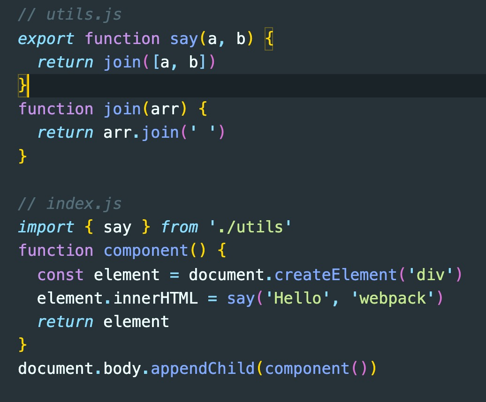
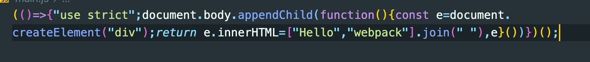

# js 模块化

## 前言

随着我们应用不断地开发，应用本身的复杂度也日渐提高，从而催生出了将应用按照一定规则分割的概念。即我们所说的“模块”。模块化可以针对业务的架构设计，可以针对编程代码的组合归纳，在某些抽象的算法形式也也有其类似的方式——分治法。 一个模块通常包含一些有用的函数类或者库或是一类相似业务的聚合。很长一段时间，JavaScript 都没有语言级（language-level）模块语法。这是因为初始的脚本都很小且简单，所以没必要将其模块化。但是不管怎样，到最后，脚本文件都会变的越来越复杂，所以 JavaScript 社区发明了许多方法将代码组织为模块——一种特殊的可以按需加载的库。

## 前端的模块化发展

* [IIFE](https://developer.mozilla.org/zh-CN/docs/Glossary/IIFE)——立刻执行函数返回对象的方式来实现模块化
* [CommonJS](https://zh.wikipedia.org/wiki/CommonJS) — 为 Node.js 创建的服务端模块化规范。
* [AMD](https://en.wikipedia.org/wiki/Asynchronous_module_definition)——早期的浏览器模块化规范
* [CMD](https://github.com/seajs/seajs)——基于AMD规范优化调整的规范
* [UMD](https://github.com/umdjs/umd) — 另外一个模块化方案，严格意义上他不是一个规范而是让 AMD 和 CommonJS 兼容的一个方案。

## 社区的各种实践

### 1. 简单的根据多个js文件进行模块化区分

``` js
// module1.js
var m1 = function() {
    ...
}
var m2 = function() {
    ...
}

// module2.js
var m3 = function() {
    ...
}
var m4 = function() {
    ...
}
```

这种做法的缺点很明显："污染"了全局变量，无法保证不与其他模块发生变量名冲突，而且模块成员之间看不出直接关系。

### 2. 对象写法

``` js
// module1.js
var module1 = {
    _count = 0,
    m1: function() {
        ...
    },
    m2: function() {
        ...
    }
}

// module2.js
var module2 = {
    _age = 0,
    m3: function() {
        ...
    },
    m4: function() {
        ...
    }
}
```

上面的函数 `m1()` 和 `m2(` ）都封装在**module1**对象里。 `m3()` , `m4()` 都封装在**module2***对象内，显著的降低全局污染的风险
但是，这样的写法会暴露所有模块成员，内部状态可以被外部改写。比如，外部代码可以直接改变 `_count` 和 `_age` 的值。

## IIFE

> `立即执行函数` （Immediately-Invoked Function Expression，IIFE）

``` js
// 通过立即执行还是生成一个具有m1, m2方法的module1，立即执行函数内部的内容不会污染全局环境
var module1 = (function() {
    // 模块私有无法被外部直接调用
    var _count = 0;
    var m1 = function() {
        //...
    };
    var m2 = function() {
        //...
    };
    //  模块保留在外的两个方法m1,m2
    return {
        m1: m1,
        m2: m2
    };

})();
```

#### webpack默认的打包内容就是IIFE模式

**打包前**



**打包后**



利用闭包就是早期avascript模块的基本写法。下面，再对这种写法进行加工。

### 放大模式（augmentation）

如果一个模块很大，必须分成几个部分，或者一个模块需要继承另一个模块，这时就有必要采用"放大模式"。

``` js
// 基于之前的module1.js
// 为module1进行扩充，增加一个具有私有变量的导出函数m3
module1 = (function(mod) {
    _age = 0;
    mod.m3 = function() {
        return _age++
    };

    return mod;

})(module1);

// 为module1进行扩充，增加一个 m4 方法
module1.m4 = function(a) {
    return a++
};
// 
```

### 宽放大模式（Loose augmentation）

在浏览器环境中，模块的各个部分通常都是从网上获取的，有时无法知道哪个部分会先加载。如果采用 `放大模式` 的写法，第一个执行的部分有可能加载一个不存在空对象，这时就要采用"宽放大模式"。

``` js
// module1.js
var module1 = (function(mod) {
    mod.m4 = function() {
        ...
    }
    return mod;

})(module1 || {});

// main.js
var module1 = (function(mod) {
    mod.m5 = function() {
        ...
    }
    return mod;

})(module1 || {});
```

### 输入全局变量

独立性是模块的重要特点，模块内部最好不与程序的其他部分直接交互。
其次也可为全局变量增加一些具有私有过程的外部使用函数

``` js
var module1 = (function($, wx) {

    //...

})(jQuery, wx);
```

## CommonJS

借用维基百科的话———CommonJS是一个项目，其目标是为JavaScript在网页浏览器之外创建模块约定。创建这个项目的主要原因是当时缺乏普遍可接受形式的JavaScript脚本模块单元，模块在与运行JavaScript脚本的常规网页浏览器所提供的不同的环境下可以重复使用。
该规范最早是用在node.js中的，它定义了四个重要的全局环境变量： `module、exports、require、global` 。其中 `module` 、 `exports` 、 `require` 提供了模块化的相关链路。

### module 和 exports (模块定义)

> 要注意的是 `exports` 其实是对 `module.exports` 的引用，可以理解为子模块顶部书写了 `exports = module.exports` 。不过一般为了通用性。广泛都采用 `module.exports` 做模块导出。

`语法` : module.exports = {a:xxx, b:xxx}

由于**module.exports本身是个对象**，所以写成以下也是可以的

``` js
module.exports.a = XXX
exports.a = XXX
```

但是写成下面这样是不行的

``` js
// 前文提过export是module.exports的引用，写成下面这样会改变引用。导致exports失去原有功能
exports = {
    a: xxx,
    b: xxx
}
```

### require(模块引用)

`语法` : xxx = require('moudleName')

在 `node.js` 中，require是使用同步的方式加载模块。那是因为在服务端，模块文件都窜在本地，读取快。不会出现问题。但在浏览器端，限于网络原因，如果同步会致使页面长时间卡顿，不够契合brower端的模块加载，不过为方便可统一书写，并通过相关转移工具(webpack等)继续转义

例子：

``` js
// index.js
const utils = require('./utils')
const el = document.createElement('div')
el.innerHTML = utils.sayHello('Hello', 'Webpack')
document.body.appendChild(el)

// utils.js
module.exports = {
    sayHello: function(a, b) {
        return a + b
    }
}
```

## AMD

`AMD` 是"Asynchronous Module Definition"的缩写，意思就是"异步模块定义"。它采用异步方式加载模块，模块的加载不影响它后面语句的运行。所有依赖这个模块的语句，都定义在一个回调函数中，等到加载完成之后，这个回调函数才会运行。他是[requirejs](https://requirejs.org/)在推广过程中对模块定义的规范化产出。需要注意的是 `AMD` 是一种模块定义的规范， `requirejs` 是实现这个规范的一种解决方案，两者不能混为一谈。例如 `r.js` 也是 `AMD` 规范的一个解决方案。webpack也有自己的实现。

### define函数(模块定义)

`语法` ：define([module1, module2, ...], callback(module1, moduel2, ...))

### require函数(模块引用)

> 注意：**此处的require和node.js中的require，功能上是类似的，但本质，和内在逻辑上是不同的**
> 此处的 `require()` 是浏览器环境的一个全局变量。是需要通过 `require.js` 这个依赖文件全局注册的。和 `define()` 是搭档关系
> node环境中的 `require()` 是全局环境定义的, 是**CMD**规范的重要组成部分，和 `module.exports、exports` 是搭档关系
> 当然由于 `require.js` 是个二五仔，所以node环境中也可以用就是了。

`语法` ：require([module], callback)

简单例子：

``` js
// math.js 通过define来定义一个名为math的模块
define(['math'], function($) {
    return {
        add: function(a, b) {
            return a + b;
        }
    }
});

// main.js  通过require来使用math模块
require(['math'], function(math) {
    math.add(2, 3);
});
```

## CMD

`CMD` 即Common Module Definition通用模块定义， `CMD` 规范是国内发展出来的，借鉴了 `CommonJS` 和 `AMD` 并调整优化的一个规范方案，是 `Sea.js` 在推广过程中对模块定义的规范化产出。
要想很好的使用需要引入 `sea.js` .

> `AMD` 推崇依赖前置、提前执行， `CMD` 推崇依赖就近、延迟执行。

### define (模块定义)

`语法` ：define(callback(require, exports, module))

### require(模块内部引用)、seaJs.use (外部引入)

`语法` ：require(moudleName)

``` js
// index.js
seajs.use(['./utils'], function(utils) {
    const el = document.createElement('div')
    el.innerHTML = utils.sayHello('Hello', 'Webpack')
    document.body.appendChild(el)
});

// utils.js
define(function(require, exports, module) {
    const sayHello = function(a, b) {
        return a + b
    }
    exports.sayHello = sayHello
})
```
